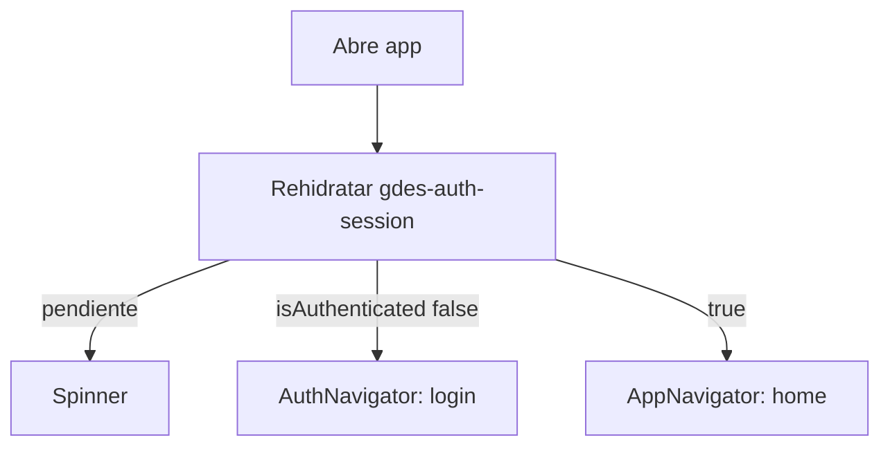
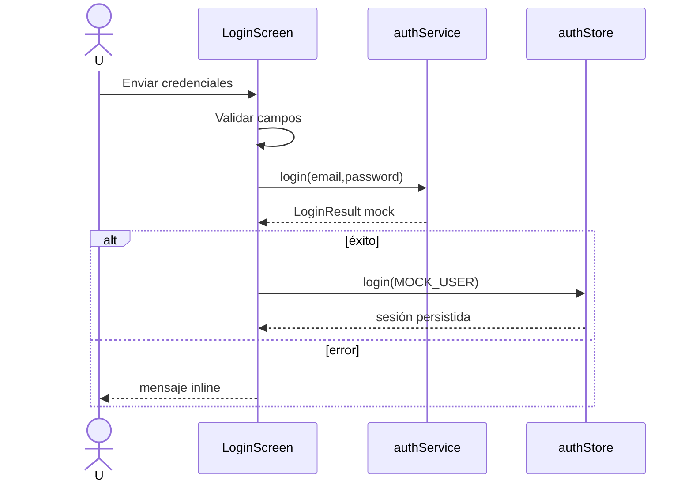
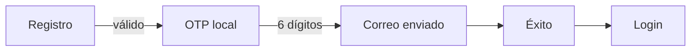
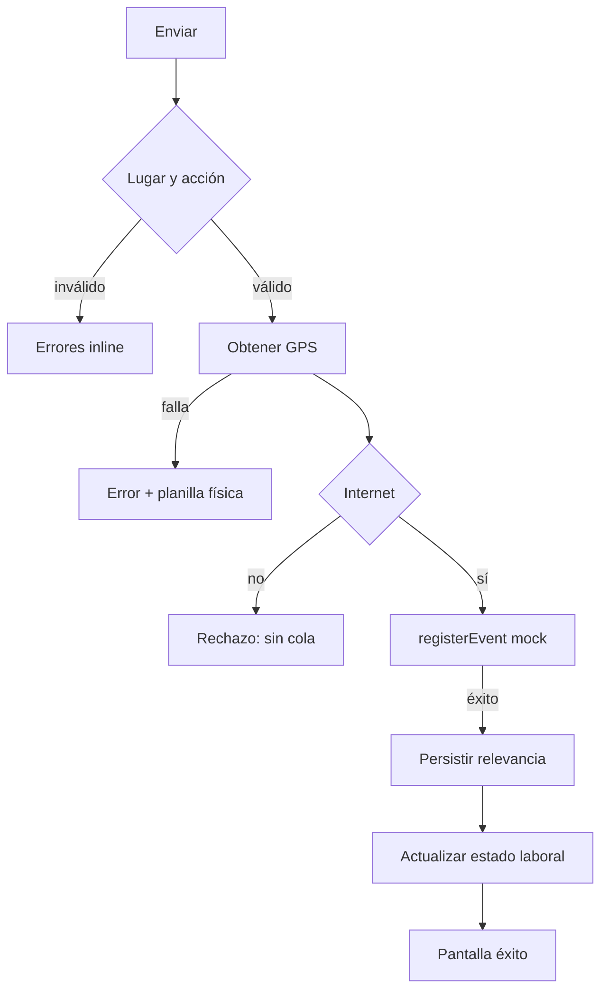
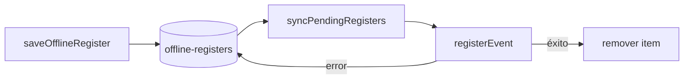
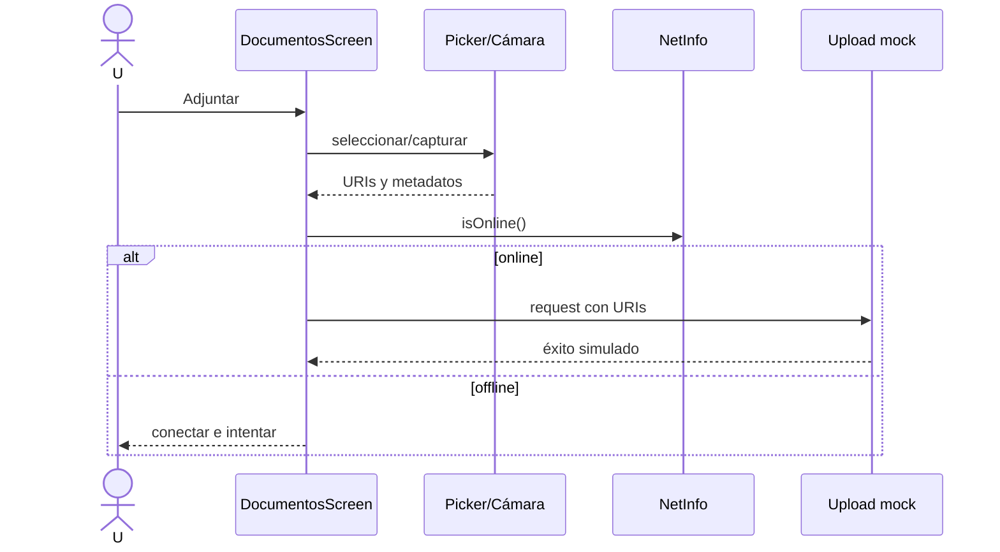

# Flujos de usuario

## 1. Arranque y sesión

`app/index.tsx` espera `hydrated`; `stores/authStore.ts` persiste `user` e `isAuthenticated`.

## 2. Login email/contraseña

**Precondición:** pantalla login. **Fuente:** `LoginScreen.tsx`, `authService.ts`.

1. Usuario completa correo/legajo y password.
2. Se valida identificador y política de password.
3. `login()` espera 800 ms y normaliza el identificador.
4. Éxito solo con `empleado@gdes.com` / `Gdes@2025`.
5. Se persiste usuario mock y el root muestra AppNavigator.
6. Error de credenciales se muestra inline; excepción usa mensaje genérico.

**Inconsistencia:** la UI permite legajo, pero el servicio no autentica `12345`.

## 3. Google mock

Login → modal con tres cuentas de `constants/data.ts` → seleccionar cualquiera → éxito temporizado 2 s → OTP → cualquier código de 6 dígitos → sesión fija `usr-google/google@gdes.com`. No hay SDK OAuth ni identidad de la cuenta elegida.

## 4. Registro

1. Login → Registrarse.
2. Se solicitan nombre, apellido, legajo, DNI, email, password, teléfono, domicilio, provincia/site y fecha de nacimiento.
3. Validaciones locales bloquean campos inválidos.
4. Si son válidos, **los datos no se envían ni almacenan**.
5. Se abre OTP WhatsApp; cualquier código de 6 dígitos avanza.
6. Pantalla “Te enviamos un correo” → Entendido.
7. Éxito temporizado 2,5 s → login.

`services/registerService.ts` no registra usuarios: registra eventos laborales y no es usado por RegisterScreen.

## 5. Recuperación

Login → olvidé contraseña → valida email → comprueba Internet → servicio mock espera 1,5 s y retorna éxito → confirmación neutral (“si existe cuenta...”) → volver. Sin token, correo ni nueva contraseña.

## 6. Navegación autenticada

Tabs manuales: documentos, home, perfil. Home incluye header; la pantalla de éxito de marcación oculta tabs y retorna automáticamente a los 2 s.

## 7. Selección de lugar

Al montar Home se cargan en paralelo lugares mock, lugar reciente, favoritos e historial. Se ordenan por relevancia y se preselecciona el reciente de la franja. Favoritos usan actualización optimista y AsyncStorage; no hay rollback si falla persistencia.

## 8. Entrada/salida/ausencia

1. Elegir lugar y acción; observación opcional.
2. Para ausencia puede elegirse motivo, pero no se envía.
3. Solicitar permiso foreground y ubicación High; timeout 120 s.
4. Si GPS falla, detener y recomendar planilla física.
5. Verificar conectividad; offline se rechaza.
6. Crear `RegisterRequest` con workplaceId, acción, observación, timestamps y coordenadas.
7. `registerEvent` simula 1 s y éxito.
8. Guardar lugar reciente/usado; entrada pone `isWorking=true`, salida `false`.
9. Mostrar éxito y resetear selección al volver.

## 9. Cola offline

Es diseño existente pero **no alcanzable**: Home tiene import comentado; tampoco hay suscripción activa que invoque sync.

## 10. Carga de planilla

Documentos → abrir modal → opcionalmente elegir lugar → cámara o galería múltiple → quitar imágenes → enviar. Requiere al menos una imagen e Internet. Construye `months: []`, envía URIs al mock, resetea y muestra éxito. El botón no exige lugar y no hay transferencia binaria.

## 11. Documentación de contingencia

Documentos → modal → selector de documentos o cámara → filtra extensiones → permite quitar → exige ≥1 archivo → Internet → request con `workplaceId: null` → mock → éxito. No valida tamaño, duplicados ni cantidad.

## 12. Perfil y logout

Perfil muestra `userProfile` fijo (Gina Tini), no `authStore.user`. Los campos son solo lectura. Logout pide confirmación, ejecuta `authStore.logout()` y el root vuelve a AuthNavigator. El estado de marcación en `useAppStore` no se limpia explícitamente.
