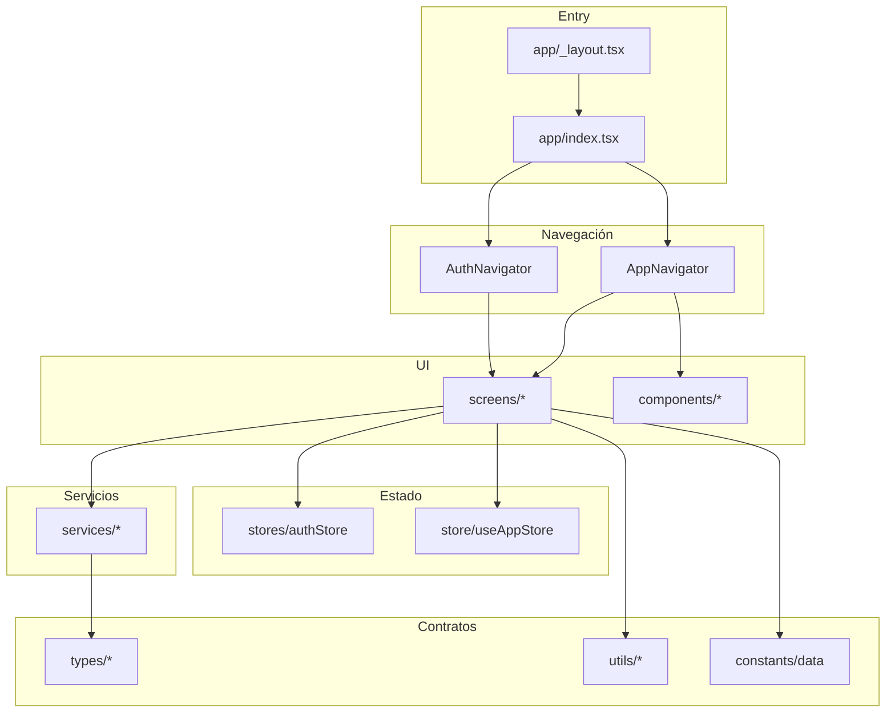
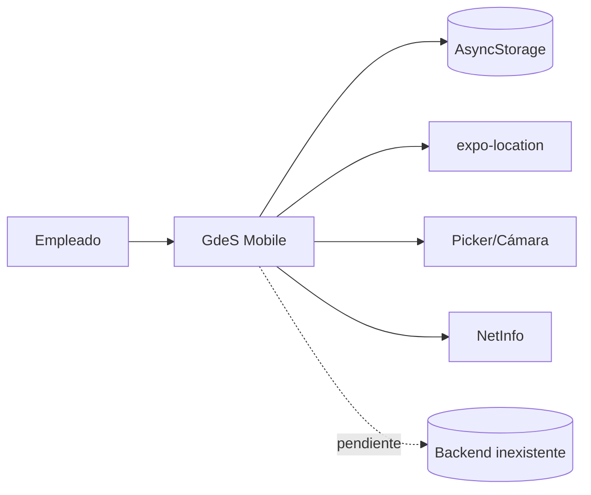

# Arquitectura técnica

## Stack

- **Expo** `~55` con `expo-router` como entrypoint (`package.json`, `main: expo-router/entry`).
- **React** `19.2.0`, **React Native** `0.83.4`, New Architecture habilitada (`app.json`).
- **NativeWind 4** + Tailwind 3 para estilos (`babel.config.js`, `tailwind.config.js`, `global.css`).
- **Zustand 4** para estado; `zustand/middleware` persist + AsyncStorage para sesión.
- **Expo modules**: `expo-location`, `expo-image-picker`, `expo-document-picker`, `expo-linking`.
- **@react-native-community/netinfo** para conectividad.
- **TypeScript** estricto, alias `@/*` (`tsconfig.json`).

## Capas

Aunque el proyecto usa expo-router, el ruteo por archivos se limita a montar `app/index.tsx`; toda la navegación real es **condicional por estado** dentro de navegadores propios.

## Entrypoints

- `app/_layout.tsx`: `SafeAreaProvider`, `StatusBar`, `Stack` con headers ocultos y fondo `#EDF2F5`; importa `global.css`.
- `app/index.tsx`: raíz que decide Auth vs App según `authStore` y muestra spinner hasta rehidratar.

## Estado

Dos stores separados:

| Store | Persistencia | Contenido | Consumidores |
|---|---|---|---|
| `stores/authStore.ts` | AsyncStorage `gdes-auth-session` | `user`, `isAuthenticated`, `hydrated` | index, navegadores, Login, Perfil |
| `store/useAppStore.ts` | En memoria | acción, lugar, observación, `isWorking`, `user` interno | HomeScreen, AppNavigator |

`useAppStore.user` es un modelo `{id,name}` distinto y sin uso real. La marcación no se persiste.

## Persistencia local (AsyncStorage)

| Clave | Servicio | Dato |
|---|---|---|
| `gdes-auth-session` | authStore | Sesión mock |
| `favorite-workplaces` | favoriteWorkplaceService | IDs favoritos |
| `used-workplaces` | usedWorkplaceService | IDs usados (recientes al frente) |
| `recent-workplaces` | recentWorkplaceService | Lugar por franja |
| `offline-registers` | offlineRegisterService | Cola offline (no alcanzable) |

## Red y dispositivo

- `networkService.isOnline` exige `isConnected` e `isInternetReachable`; ante error asume offline.
- `subscribeToConnectivity` detecta transición offline→online, pero ningún módulo la suscribe.
- `locationService` fuerza permisos foreground y precisión alta con timeout de 120 s y errores tipados.

## Diagrama de contexto

## Decisiones observadas

- Servicios asíncronos que simulan latencia para facilitar el reemplazo por API real.
- Contratos tipados (`types/api.ts`, `types/document.ts`) ya modelan payloads previstos.
- Separación de responsabilidades UI/servicios/estado consistente pese a ser mock.

## Riesgos estructurales

- Datos de lugares duplicados en tres fuentes (`workplaceService`, `types/document`, `constants/data`) con IDs distintos.
- Dos stores y dos modelos de usuario generan ambigüedad sobre la identidad vigente.
- Navegación manual sin historial nativo dificulta deep links y back del sistema.
