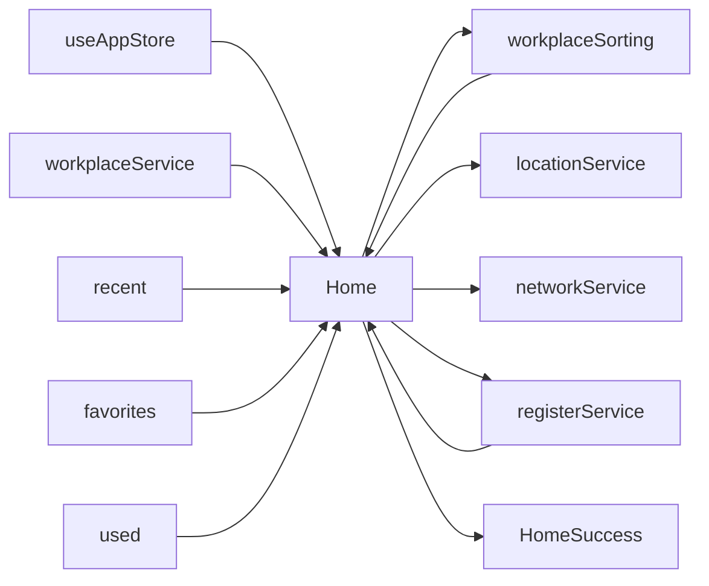

# Servicios, datos y contratos

## Servicios

| Servicio | Archivo | Naturaleza | Notas |
|---|---|---|---|
| authService | `services/authService.ts` | Mock | Credenciales fijas; delay 800 ms. |
| registerService | `services/registerService.ts` | Mock | `registerEvent` éxito; `registerEventWithError` para pruebas. |
| workplaceService | `services/workplaceService.ts` | Mock | 3 lugares; delay 800 ms. |
| favoriteWorkplaceService | `services/favoriteWorkplaceService.ts` | Local | CRUD de favoritos en AsyncStorage. |
| recentWorkplaceService | `services/recentWorkplaceService.ts` | Local | Lugar por franja mañana/tarde. |
| usedWorkplaceService | `services/usedWorkplaceService.ts` | Local | Historial con más reciente al frente. |
| locationService | `services/locationService.ts` | Real dispositivo | GPS High, timeout 120 s, errores tipados. |
| networkService | `services/networkService.ts` | Real dispositivo | `isOnline` y `subscribeToConnectivity`. |
| offlineRegisterService | `services/offlineRegisterService.ts` | Local, inactivo | Cola `offline-registers`. |
| syncService | `services/syncService.ts` | Inactivo | Sincroniza cola contra mock. |
| uploadDocumentService | `services/uploadDocumentService.ts` | Mock | Planillas; delay 1 s. |
| documentService | `services/documentService.ts` | Mock | Contingencia; delay 1,5 s. |

## Contratos

### Marcación (`types/api.ts`)

```ts
RegisterAction = "entrada" | "salida" | "ausencia"
RegisterRequest { workplaceId; action; observation?; timestamp; latitude; longitude; accuracy; locationTimestamp }
RegisterResponse { success; message; registrationId? }
ApiError { code; message }
```

`observation` viaja, pero el motivo de ausencia no se incorpora al request en `HomeScreen`.

### Documentos (`types/document.ts`)

```ts
DocumentUploadRequest { workplace; months: string[]; files: string[]; uploadedAt }
DocumentUploadResponse { success; message; documentId? }
SelectedFile { uri; name; type; size }
ContingencyUploadRequest { workplaceId: string|null; files: SelectedFile[]; uploadedAt }
ContingencyUploadResponse { success; message }
ALLOWED_EXTENSIONS = pdf,jpg,jpeg,png,docx,doc,txt
```

Planilla envía `months: []` fijo y URIs de imagen. Contingencia envía `workplaceId: null`.

### Workplace (`types/workplace.ts`)

```ts
Workplace { id; name; siteId; siteName; active }
```

### Sesión (`stores/authStore.ts`)

```ts
AuthUser { id; nombre; apellido; email; legajo }
```

## Datos mock

- **Lugares Home**: wp-1/2/3 (Hospital Central/Norte, Clínica San José) en `workplaceService.ts`.
- **Lugares documentos**: wp-001/002/003 con nombres similares en `types/document.ts`.
- **Lugares legacy**: `constants/data.ts` (Oficina Central, etc.) no usados por Home.
- **Perfil**: `userProfile` (Gina Tini) en `constants/data.ts`.
- **Cuentas Google**: `googleAccounts` en `constants/data.ts`.
- **Provincias**: seis valores en `constants/data.ts`.
- **documents/months**: definidos en `constants/data.ts` sin consumidor de negocio.

## Manejo de errores

- Servicios locales atrapan y retornan valores neutros (`[]`, false) sin propagar.
- `locationService` lanza `LocationError` tipado consumido por Home.
- Servicios mock nunca fallan salvo `registerEventWithError`.
- La UI traduce fallas a mensajes que sugieren planilla física cuando aplica.

## Flujo de datos de marcación


