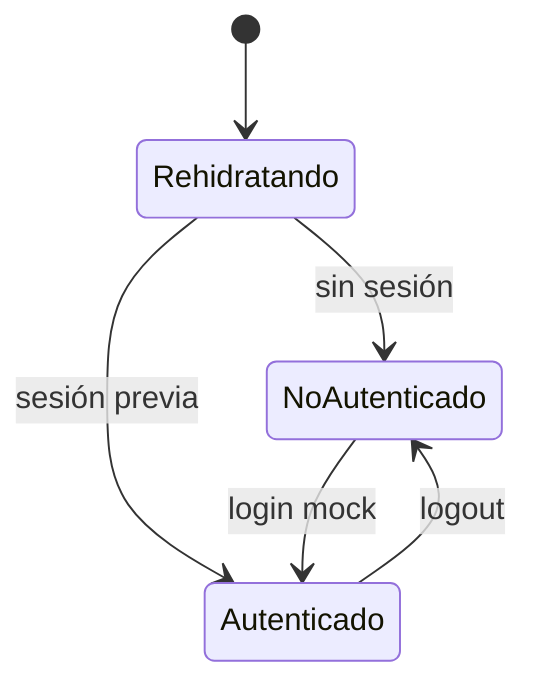

# Autenticación y seguridad

> Estado actual: autenticación simulada. No hay backend, tokens ni cifrado. Lo aquí descrito no debe considerarse seguro para producción.

## Ciclo de sesión

1. Login valida y llama a `authService.login` (mock).
2. Éxito guarda `AuthUser` en `authStore` con persist a AsyncStorage (`gdes-auth-session`).
3. `app/index.tsx` decide navegador según `isAuthenticated` tras `hydrated`.
4. Logout limpia usuario y sesión persistida.

## Credenciales mock (según lo solicitado)

Definidas en `services/authService.ts` y **son de desarrollo, no productivas**:

- Email: `empleado@gdes.com`
- Password: `Gdes@2025`
- Usuario resultante: `usr-001`, Juan Pérez, legajo `12345`.

Login Google produce siempre `usr-google` / `google@gdes.com` sin importar la cuenta elegida (`AuthNavigator.completeGoogleAuth`). El perfil visible (`userProfile`, Gina Tini) no coincide con ninguno de estos usuarios.

## Almacenamiento sensible

- Sesión y datos operativos se guardan en AsyncStorage en claro; no hay SecureStore ni cifrado.
- No se emiten ni almacenan tokens; no hay expiración de sesión.
- Coordenadas GPS se envían en el payload mock y se registran con `console.log`.

## Validaciones de entrada

Centralizadas en `utils/validations.ts`: email, email-o-legajo, password (política completa), teléfono (10–13 dígitos), DNI (7–8), legajo numérico, OTP de 6 dígitos y requeridos.

## Superficie y riesgos

| Riesgo | Evidencia | Impacto |
|---|---|---|
| Credenciales embebidas | `authService.ts` | Acceso trivial; deben salir del cliente. |
| Sin token/expiración | authStore | Sesión indefinida. |
| Google sin OAuth | AuthNavigator | Identidad no verificada. |
| OTP no verificado | VerifyCodeScreen | Control ficticio. |
| AsyncStorage sin cifrar | servicios locales | Datos legibles en dispositivo comprometido. |
| GPS en logs | HomeScreen | Fuga de ubicación en logs. |
| Recuperación siempre exitosa | passwordRecoveryService | No hay flujo real. |

## Recomendaciones al integrar backend

- Autenticación por token con expiración y refresh; mover credenciales al servidor.
- OAuth real de Google y verificación efectiva de OTP.
- SecureStore/Keychain para tokens; minimizar datos en claro.
- Reutilizar `validatePassword` también en servidor.
- Retirar logs con datos personales/ubicación.
