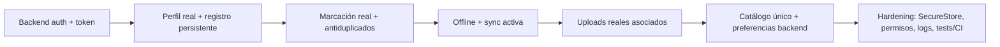

# Deuda técnica y roadmap

Prioridad por impacto en correctitud, seguridad y mantenibilidad. Cada ítem cita evidencia.

## Crítico

1. **Autenticación mock con credenciales embebidas.** `services/authService.ts`. Sin backend, token ni expiración. Reemplazar por API real y sacar credenciales del cliente.
2. **Google login sin OAuth.** `AuthNavigator.completeGoogleAuth` inyecta usuario fijo. Integrar OAuth real o retirar la opción.
3. **OTP no verificado.** `VerifyCodeScreen`/`validateOTPCode` aceptan cualquier 6 dígitos. Integrar envío/verificación reales.
4. **Recuperación simulada.** `passwordRecoveryService` siempre retorna éxito. Falta token, correo y cambio de contraseña.
5. **Cargas de archivos simuladas.** `documentService`/`uploadDocumentService` no transfieren binarios. Implementar upload real (multipart/firmado) y asociación a usuario/lugar (TODOs en `documentService.ts`).

## Alto

6. **Perfil desconectado de la sesión.** `PerfilScreen` usa `userProfile` fijo (Gina Tini) en vez de `authStore.user`. Mostrar el usuario autenticado real.
7. **Login por legajo no funcional.** UI acepta legajo, servicio solo compara email. Alinear validación y autenticación.
8. **Marcación offline inactiva.** `offlineRegisterService`/`syncService` existen, pero Home rechaza sin Internet y el import está comentado (`HomeScreen.tsx`). Conectar cola + `subscribeToConnectivity` o retirar el código muerto.
9. **Motivo de ausencia no persiste.** Se captura en estado local pero no se agrega a `RegisterRequest`. Incluirlo en el contrato y payload.
10. **Catálogos de lugares duplicados/incoherentes.** IDs distintos entre `workplaceService` (wp-1..3), `types/document` (wp-001..003) y `constants/data`. Unificar fuente única.
11. **Instalación reproducible bloqueada.** `npm ci` falla: `react-dom@19.2.8` requiere `react@^19.2.8`, pero `package.json` fija `react@19.2.0`. Alinear versiones compatibles de React/React DOM/Expo y regenerar lockfile.

## Medio

12. **Dos stores y dos modelos de usuario.** `store/useAppStore` vs `stores/authStore`; `useAppStore.user` sin uso. Unificar identidad y ubicación de stores.
13. **`isWorking` volátil.** Vive solo en memoria; se pierde al reiniciar y no deriva del backend.
14. **Logout no limpia marcación.** `useAppStore` conserva selección/observación tras cerrar sesión.
15. **Favoritos sin rollback.** Actualización optimista sin revertir si AsyncStorage falla (`HomeScreen.handleToggleFavorite`).
16. **Sin límites en documentación.** No hay tope de tamaño, cantidad ni validación de duplicados (`DocumentosScreen`).
17. **GPS y requests en logs.** `console.log` con coordenadas y payloads en Home/servicios.
18. **Pantallas/componentes sin uso.** `LoginSuccessScreen`, `ForgotSuccessScreen`, y posibles `login-form`/`login-header`/`input-field`/`button`/`google-icon`. Confirmar y depurar.

## Bajo

19. **Permisos sin cadenas de uso en `app.json`.** Necesario para builds nativos de producción.
20. **Sin lint/test/typecheck en scripts.** Añadir tooling y CI.
21. **`registerEventWithError` de prueba en producción del bundle.** Evaluar aislar utilidades de test.
22. **Franja horaria rígida.** Solo mañana/tarde con corte fijo (`recentWorkplaceService`).
23. **Mezcla de idiomas.** Comentarios/logs en inglés y UI en español; definir criterio.

## TODOs presentes en el código

- `HomeScreen.tsx`: almacenamiento y sincronización offline futura (import comentado).
- `authService.ts`, `AuthNavigator.tsx`: reemplazar auth mock y Google real.
- `documentService.ts`: endpoint real, asociación a usuario y a workplace.
- `uploadDocumentService.ts`: llamada real de carga.
- `passwordRecoveryService.ts`: endpoint real de recuperación.
- `workplaceService.ts`, `usedWorkplaceService.ts`, `workplaceSorting.ts`, `recentWorkplaceService.ts`: reemplazar datos/ranking local por backend.
- `favoriteWorkplaceService.ts`: sincronizar favoritos con backend.
- `validations.ts`: reutilizar `validatePassword` en registro, cambio, recuperación y backend.

## Roadmap sugerido (visión objetivo)

Este roadmap es una recomendación derivada de los TODO y limitaciones del código, no una especificación provista por el negocio.
