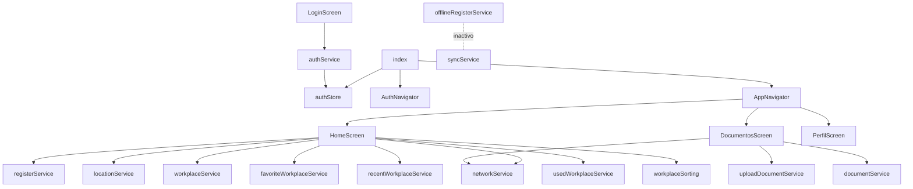

# Mapa del codebase

Referencia rápida de responsabilidad y relaciones por archivo.

## Entrypoint y configuración

| Archivo | Responsabilidad |
|---|---|
| `app/_layout.tsx` | Root layout expo-router; providers, StatusBar, `global.css`. |
| `app/index.tsx` | Decide Auth vs App según `authStore`; spinner de hidratación. |
| `app.json` | Configuración Expo (nombre, iconos, plugins, plataformas). |
| `babel.config.js` | Preset Expo + NativeWind. |
| `metro.config.js` | Configuración Metro. |
| `tailwind.config.js` | Tokens de color y contenido NativeWind. |
| `global.css` | Directivas Tailwind. |
| `tsconfig.json` | Strict + alias `@/*`. |
| `package.json` | Dependencias y scripts Expo. |

## Navegación

| Archivo | Responsabilidad | Depende de |
|---|---|---|
| `navigation/AuthNavigator.tsx` | Flujo no autenticado por pasos. | screens de auth, GoogleModal, authStore. |
| `navigation/AppNavigator.tsx` | Flujo autenticado (tabs). | Home/Documentos/Perfil, header, tabs, stores. |

## Pantallas

| Archivo | Responsabilidad | Servicios/estado |
|---|---|---|
| `screens/LoginScreen.tsx` | Login mock. | authService, authStore, validations. |
| `screens/RegisterScreen.tsx` | Alta (sin persistir). | validations, provincias. |
| `screens/VerifyCodeScreen.tsx` | OTP mock. | validateOTPCode. |
| `screens/ForgotPasswordScreen.tsx` | Recuperación mock. | passwordRecoveryService, networkService. |
| `screens/SuccessScreens.tsx` | Confirmaciones/temporizadores. | Icons, ActionType. |
| `screens/HomeScreen.tsx` | Marcación GPS/red. | register/location/network/workplace + favoritos/recientes/usados + sorting + stores. |
| `screens/DocumentosScreen.tsx` | Planillas y contingencia. | pickers, network, upload services, types/document. |
| `screens/PerfilScreen.tsx` | Perfil fijo y logout. | userProfile, authStore (logout vía prop). |

## Componentes

| Archivo | Responsabilidad |
|---|---|
| `components/AppHeader.tsx` | Logo en Home. |
| `components/BottomTabs.tsx` | Tabs manuales. |
| `components/GoogleModal.tsx` | Cuentas Google mock. |
| `components/InputWithError.tsx` | Campo con error (activo). |
| `components/OTPInput.tsx` | Entrada OTP. |
| `components/Icons.tsx` | Íconos SVG (activo). |
| `components/button.tsx` `input-field.tsx` `login-form.tsx` `login-header.tsx` `google-icon.tsx` | Piezas de formulario; verificar uso real antes de reutilizar. |

## Estado

| Archivo | Responsabilidad |
|---|---|
| `stores/authStore.ts` | Sesión persistida + `hydrated`. |
| `store/useAppStore.ts` | Marcación en memoria; `user` interno sin uso. |

## Servicios

| Archivo | Naturaleza |
|---|---|
| `services/authService.ts` | Mock auth. |
| `services/registerService.ts` | Mock marcación. |
| `services/workplaceService.ts` | Mock lugares. |
| `services/favoriteWorkplaceService.ts` | Local favoritos. |
| `services/recentWorkplaceService.ts` | Local reciente por franja. |
| `services/usedWorkplaceService.ts` | Local historial. |
| `services/locationService.ts` | GPS real con timeout. |
| `services/networkService.ts` | Conectividad real. |
| `services/offlineRegisterService.ts` | Cola local (inactiva). |
| `services/syncService.ts` | Sync (inactivo). |
| `services/uploadDocumentService.ts` | Mock planillas. |
| `services/documentService.ts` | Mock contingencia. |

## Tipos, utils y constantes

| Archivo | Responsabilidad |
|---|---|
| `types/api.ts` | Contrato de marcación. |
| `types/document.ts` | Contratos de documentos + lugares mock + extensiones. |
| `types/workplace.ts` | Modelo Workplace. |
| `utils/validations.ts` | Validaciones de formularios. |
| `utils/workplaceSorting.ts` | Ranking de lugares. |
| `constants/data.ts` | Perfil, cuentas Google, provincias y catálogos legacy. |

## Relaciones clave

